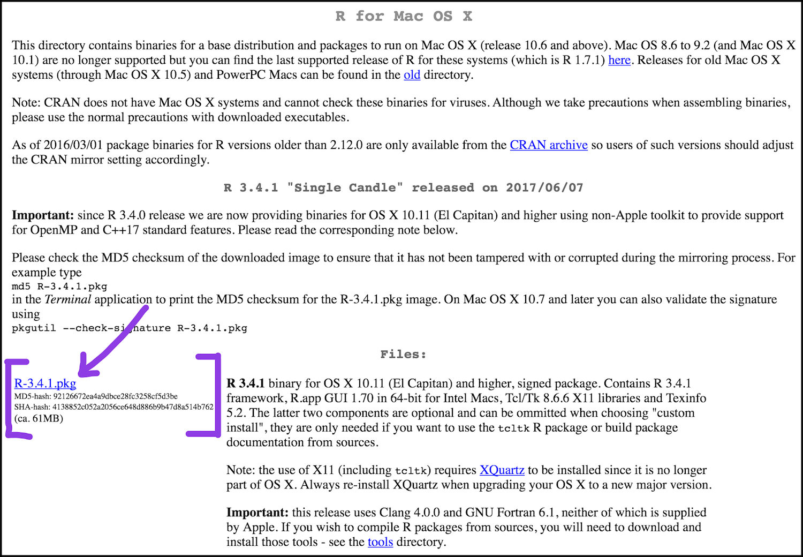
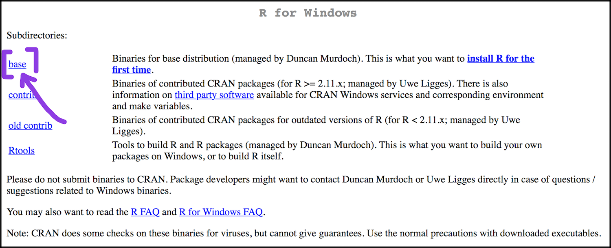
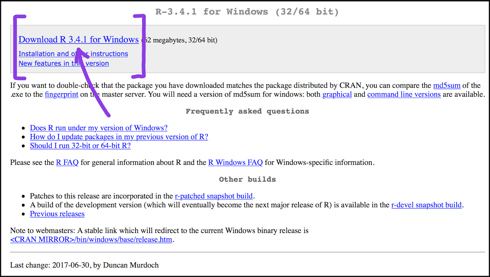
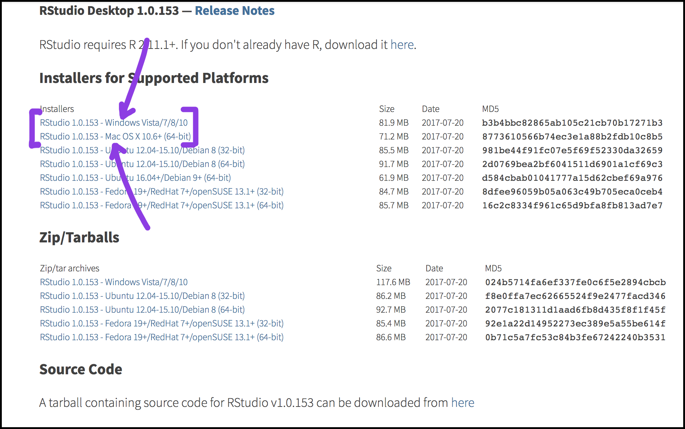

# Basic Text Analysis with R

*This workshop will introduce the basics of working with R for text analysis. We'll get set up with a practice corpus and use some simple functions to familiarize ourselves with the R research workflow. By the end of the class, participants will know how to install and use R packages suitable for their own projects going forward. This workshop was written in September, 2017 by Lawrence Evalyn at the University of Toronto.*

This workshop comes to you today in three parts:
1. A substantial introductory period on "how do I run R on my computer anyway" and "how do I install R packages"
2. A mini research delve into a particular R command or two
3. A survey of commonly-used R packages/commands, with a take-home resource on their names

## "how do I run R on my computer anyway"

R is a programming language, not a program. In the interest of simplicity, we'll be using a program, RStudio, to run previously-written R code. It's so simple, there are only these complicated steps required before you can do anything useful:
1. Install R
1. Install RStudio
1. Install the R package you want to use
1. Tell R we want to actually use the package we just installed

Installing things is never as easy as it seems like it should be. In my experience, using a programming language instead of a program means installing a matryoskha doll of bits and pieces of code from different places, all of which depend on each other and assume I already know how to use them. This three-hour workshop has half an hour dedicated to trying to get 80% of the laptops in the room successfully running R.

Let's break it down a step at a time:

### 1. Install R

Download R from [The Comprehensive R Archive Network](https://cran.r-project.org/).

#### On a Mac

1. Install R
<!--1. Install XQuartz ?-->

The thing you want to click to download R is this:

<!--Then you will need to download and install [XQuartz](https://www.xquartz.org/) too.-->

#### On a Windows

You'll have to click two things. First, all we need to install is the base:

And then you can download R:

### 2. Install RStudio

[Download RStudio](https://www.rstudio.com/products/rstudio/download/)

### 3. Install [whatever packages I've just chosen to use]

### 4. Load the packages with the "library" command

## 2. A mini research delve into a particular R command or two, like in the lesson you linked (2 hrs?) -- I'll pick something that seems fun. This part will include some discussion of what makes a corpus or a research question suitable for statistical analysis.

I'd like to do:
* Stylo: use Austen & Radcliffe; use "oppose" to find Gothic/non-Gothic vocabulary; use authorship attribution, talk about why Northanger is going to definitely be with Austen... will take a little more work, but will correspondingly possibly be more useful, is most suited to my own expertise
* oh, replicate Ramsay's thing that he did with The Waves? Perhaps that plus stylo? a great way to talk about how to develop research questions for text analysis; there is no "Analyse" package

I'm not going to do, but should include resources about:
* The Programming Historians dive into basic word counts, sentence length... easy, but not exciting; not really the kind of text analysis that requires a specialized tool like T to do?
* Topic Modelling: trendy, but it's SO hard to have a corpus for which it actually makes sense to use topic modelling... and you have to have CSV files and all kinds of mess, rather than raw text

## Resources

### Useful Packages

* tidyverse
* tokenizers
* To directly load an Excel file into the R console, you first have to install the readxl
* running a full NLP annotation pipeline on the text to extract features such as named entities, part of speech tags, and dependency relationship. These are available in several R packages, including cleanNLP
* fitting topic models to detect particular discourses in the corpus using packages such as mallet and topicmodels.
* applying dimensionality reduction techniques to plot stylistic tendencies over time or across multiple authors. For example, the package tsne performs a powerful form of dimensionality reduction particularly amenable to insightful plots.
* stylo: https://sites.google.com/site/computationalstylistics/stylo

### Other Tutorials

### Glossay

* R
* RStudio
* script
* package
* function

### U of T Resources

If you don't want to deal with installing R or RStudio yourself, the [Map and Data Library computer lab inside of Robarts](https://mdl.library.utoronto.ca/technology/computer-lab) has 20 computers with R and RStudio already installed.